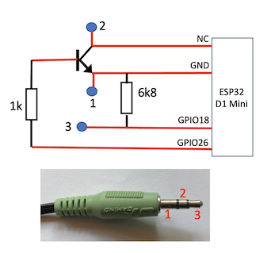
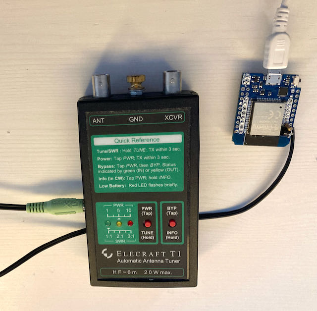
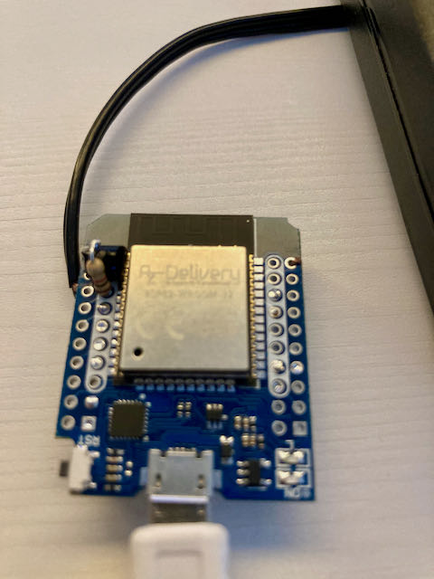
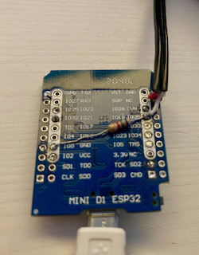

# T1 interface for ICOM IC-705
As I am operating my IC-705 remotely by means of WFView (www.wfview.org), I was searching for an easy way to switch my Elecraft T1 tuner to the right settings when changing the frequency. The T1 stores its settings for each band which can be recalled via the control lines available on the jack socket of the T1. 

The control lines are connected to an ESP32 D1 mini which fetches the current frequency via bluetooth from the ic-705. When the frequency of the TRX changes, the ESP32 will send the new band number to the T1 forcing it to change its settings. For a few seconds the T1 will wait for a rf carrier. So, if one would like to retune, it would be enough to send a carrier directly after the frequency was changed.
 
 
The transistor (npn, e.g. BC547 or similar) and the resistor is soldered directly on the pin bar, the NC pin is just used to connect the collector to the wire. 

  
After initial pairing of the ESP32 and ic-705, it is required to power-on the ESP32, before the ic-705 is switched on.  
The code is based on the code from 
 Ondrej Kolonicny (OK1CDJ) https://github.com/ok1cdj/IC705-BT-CIV 
 for controlling the ic-705 via bluetooth 
 and 
 Matthew Robinson (VK6MR) https://zensunni.org/blog/2011/01/19/arduino-elecraft-t1-interface/ 
 for controlling the T1 by means of an ardunio. 

Need for improvement: 
The code for controlling the T1 includes some delay() statements, which block the bluetooth communication for a while. This leads to error messages "esp_spp_cb(): RX Full! Discarding 22 bytes" within the PlatformIO console. Although it seems to have no impact to the correct function, it should be solved later on. 
